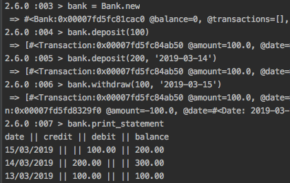

# Bank tech test

## Summary

- Bank app with basic deposit, withdrawal and statement printing functionality.
- All tests and linting passing. 100% coverage. 

### Instructions for use

- The app is designed to be run from a REPL like `irb`. Please install this locally, alongside `ruby` and the `bundle` gem.
- Clone the repository and execute `bundle install` in the project root to install dependencies. 
- Tests can be run by executing `rspec` in the project root.
- Lint the project by executing `rubocop` in the project root.
- Coverage is provided by `simplecov` and can be found in `coverage/index.html` after running `rspec`.
- In `irb`, `require_relative 'lib/bank'`

Functionality illustrated:



### Approach

- App has been TDDd, starting with feature tests `spec/bank_feature_spec.rb` and supplemented by unit tests when needed (`spec/*_spec.rb`).
- Periodic refactorings to move functionality out into separate classes.

### Structure

- `Bank`: Interacts with the user. Allows the user to initiate deposits, withdrawals and print a statement of transactions (delegated). 
- `Printer`: Constructs a correctly formatted statement and `puts`'s it to the terminal.
- `Transaction`: Contains the key data for a transaction (date, amount, balance)

### Assumptions
- That proper Date objects are needed
- That ordering should be done by Date rather than by the order of transaction entering
- I have not implemented a 'live' balance: it is locked to the balance when the transaction is made.
    - As requirement didn't specify the editing of previously entered transactions, this didn't interfere with implementation.

## Instructions

Today, you'll practice doing a tech test.

For most tech tests, you'll essentially have unlimited time.  This practice session is about producing the best code you can when there is a minimal time pressure.

You'll get to practice your OO design and TDD skills.

You'll work alone, and you'll also review your own code so you can practice reflecting on and improving your own work.

### Requirements

* You should be able to interact with your code via a REPL like IRB or the JavaScript console.  (You don't need to implement a command line interface that takes input from STDIN.)
* Deposits, withdrawal.
* Account statement (date, amount, balance) printing.
* Data can be kept in memory (it doesn't need to be stored to a database or anything).

### Acceptance criteria

**Given** a client makes a deposit of 1000 on 10-01-2012  
**And** a deposit of 2000 on 13-01-2012  
**And** a withdrawal of 500 on 14-01-2012  
**When** she prints her bank statement  
**Then** she would see

```
date || credit || debit || balance
14/01/2012 || || 500.00 || 2500.00
13/01/2012 || 2000.00 || || 3000.00
10/01/2012 || 1000.00 || || 1000.00
```
